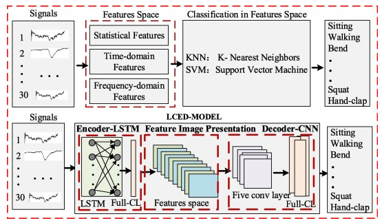

# Recognition Activity

[]

This code was update by Douglas Amante.

## Overview 

Human Activity recogntion using Wifi Signals is widespread for smart environment domain in recent years. Existing researches use learning based methods to obtain several features of acitivty data and then recognize human activies. As everybody know, propagation characteristics of WiFi signals are different for individual under different place conditions even in the same environment. In this paper[Towards CSI-based diversity activity recognition via LSTM-CNN encoder-decoder neural network], the authors focus on how to weaken the accuracy differences among individuals on activity recognition and improve the robustness in one indoor environment. Based on this, these authors a novel deep learning model called LCED. It consists of one LSTM based encoder, features image presentation and one CNN based Decoder to weaken the accuracy differences among individuals on activity recognition.

## DataSet Activies

- Horizontal Arm Wave
- High Arm Wave
- Two Hands Wave
- High Throw
- Draw X
- Draw Tick 
- Toss Paper
- Forward Kick
- Side Kick 
- Bend
- Hand Clap
- Walking
- Phone Call
- Drink Water
- Sitting 
- Squat

## RequirementsNumpy

Tensorflow Latest Version

sklearn

Numpy

## Model Architecture

## Conclusion

The authors propose a new model, cited as “LCED”. This model explores the accuracy differences among individuals on human activity recognition using WiFi signals. To be specfic the authors desgined a series of the pre processing methods to obtain high quality activity data and them use some Artificial Intelligence approaches, like: KNN, RNN and SVM as comparative objects to analyze the performance of LCED model on human activity. The results show that the comparative objects achieve the accuracy of 75% - 85%, and LCED model achieves the average accuracy is high 95%.
To future the authors will focus on the accuracy difference of indoor environments on human activity recognition and attempt to design a deep mutual learning model to impove the stability of activity recogntion under different indoor environmns.
This repository Human Activity Recognition using Channel State Information for Wifi Applications

Good Luck for test.
